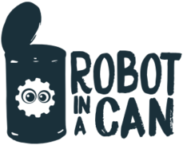

# Robot in a Can eBrain Snap!

v2.0.5

Robot in a Can's custom Snap! distro.

## Motivation

## Screenshots

Comming Soon

## Tech/framework used

<b>Built with</b>

- [Python](https://en.wikipedia.org/wiki/Python_(programming_language)) (firmware)
- [Snap!](https://cloud.snap.berkeley.edu/) (Educational programming environment)
- [Javascript](https://www.javascript.com/)

## What makes our project stand out? 

The world needs more curious, creative, and confident kids. We help solve this. 
Kids are growing up in an increasingly digital world, but most schools don't have the resources to teach them how to code or program their own robots 🤖 . This means that they're missing out on some of the best opportunities for learning and creativity today.

Robot In A Can is a new after school coding and robotics club where we help kids learn how to code and build their own robots with little or no experience! We offer both summer camp sessions as well as year-round classes during school breaks. Our goal is to give your 👧 &👦 hands-on skills that will empower them throughout life!

## Installation

- [Download this Repo](https://github.com/Robot-In-A-Can/eBrain-Snap/)
- Turn on your [eBrain](https://robotinacan.com/products/dev-board-1-7)
- Connect to your eBrain's WiFi
- Open "Launch Snap.html" 

    - Alternatively jump right in an use ["Launch Snap.html"](https://raw.githack.com/Robot-In-A-Can/eBrain-Snap/develop/Snap/snap-no-logging.html) to get started right away. 

## How to use?

## Contribute

Make better [contributing guideline](https://github.com/zulip/zulip-electron/blob/master/CONTRIBUTING.md) 

## Credits

Inspired by Makers and Hackers worldwide. Developed by the Robot in a Can team.

## License

The Affero General Public License is a free, copyleft license for software and other kinds of works.

AGPL © [RIAC]([https://robotinacan.com](https://robotinacan.com/))
